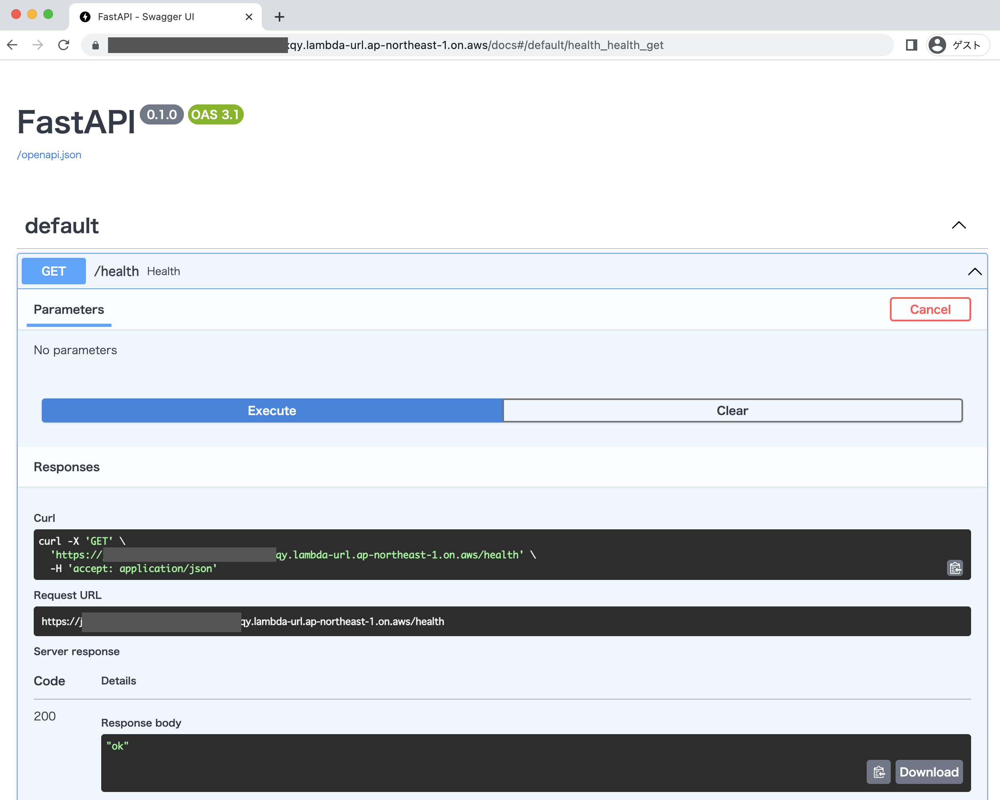

# How to create AWS resources
Edit aws_account_id and do `apply`.
```shell
$ cd terraform
$ vi terraform.tfvars
$ terraform apply
```
Function URL of lambda is displayed when apply is complete.
```
Outputs:
api_url = "https://*****************d5eboi0tjxqy.lambda-url.ap-northeast-1.on.aws/"
```

# How to Deploy
```shell
$ cd lambda_minimum_serverless_api
$ tar -cJh . | docker build -t apps/sample/api:latest -
$ docker tag apps/sample/api ${YOUR_ACCOUNT_ID}.dkr.ecr.ap-northeast-1.amazonaws.com/apps/sample/api
$ aws ecr get-login-password --region ap-northeast-1 | docker login --username AWS --password-stdin ${YOUR_ACCOUNT_ID}.dkr.ecr.ap-northeast-1.amazonaws.com
$ docker push ${YOUR_ACCOUNT_ID}.dkr.ecr.ap-northeast-1.amazonaws.com/apps/sample/api
Using default tag: latest
The push refers to repository [*************.dkr.ecr.ap-northeast-1.amazonaws.com/apps/sample/api]
3081d709ee8a: Pushed
...
latest: digest: sha256:d12aa06e6966509f877d5da4b61b0d87b68a6fab21409b7492f81714a7fa3cbe size: ****
$ aws lambda update-function-code --region ap-northeast-1 --function-name lambda_minimum_serverless_api --image-uri ${YOUR_ACCOUNT_ID}.dkr.ecr.ap-northeast-1.amazonaws.com/apps/sample/api@sha256:d12aa06e6966509f877d5da4b61b0d87b68a6fab21409b7492f81714a7fa3cbe
```


# How to Access
Open browser and access function URL.



# More details
More details are explained in the following article.

https://qiita.com/ugu/items/ffcff085daa4536444dc
